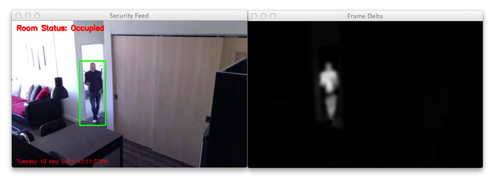

# Object Tracking Report

## Introduction

The topic is object tracking, which is track the existence of object in a video. Several method are used, which include find the difference between frames, object tracking, and also Haar-Cascades. 

## Delegation of tasks

At the begining, each member are responsible to research on different method of existing object tracking algorithm. We then lsit out all the possible solution, which include as below 

   1. Object Tracking

   2. Track by difference

   3. Track by color

   4. Haar-Cascades

We then decide to explore into each method. Region of interest are in charge by Ng Wei Shyang, Neoh Wei in charge of track by difference and Koay Kian Wheng in charge for Haar-Cascades. Ng Wei Shyang and Neoh Wei then collaborate to combined each method together. 

## Review

### Object Tracking

Tracker algorithm are provide by OpenCV Library [[1]](https://docs.opencv.org/3.3.1/d9/df8/group__tracking.html). Several algorithm are provided by OpenCV, which few will be explain below.

#### KCF

KCF algorithm is an algorithm that take advantages of the properties of circulant matrix to enhance the processing speed. KCF algorithm is an extended implementation of KFC color-names feature[[2]](http://www.robots.ox.ac.uk/~joao/publications/henriques_tpami2015.pdf). KCF is only available for OpenCV 3.1 and above. 

#### GOTURUN

GOTURN algorithm is based on Concolutional Neural Network(CNN) [[3]](http://davheld.github.io/GOTURN/GOTURN.pdf). 

#### MIL

MIL Algorithm seperate background from object by trains a classifier. 

#### BOOSTING

BOOSTING algorithm is AdaBoost algorithm implementation for real-time object tracking. It uses background as negative example to avoid drifting problem. 

#### Comparison

BOOSTING are the fastest among all, MIL being more accurate than BOOSTING, meanwhile GOTURN able to track under different light or inteference by other object. KCF being the best for general use as it is faster than MIL, and more accurate than MIL. Therefore, KCF had been choosen as GOTURN are also require to train the tracker. 

### Track By Difference

One of the way to track object is by comparing the current frame with frame that had previously appeared[[4]](https://www.pyimagesearch.com/2015/05/25/basic-motion-detection-and-tracking-with-python-and-opencv/). This is most useful in usage where the video doesn't move around and the moving obejct are significantly far away from the video. This is done by minus the current frame with the first frame, and hence getting the part that had changed. 

```Python
#Find different between frame
frameDelta = cv2.absdiff(firstFrame, frame)
#Using threshold and make it into bianry image
thresh = cv2.threshold(frameDelta, 25, 255, cv2.THRESH_BINARY)[1]

#Dilate the different area
thresh = cv2.dilate(thresh, None, iterations=2)
#Get the area that are different
_, cnts, _ = cv2.findContours(thresh.copy(), cv2.RETR_EXTERNAL, cv2.CHAIN_APPROX_SIMPLE)
```



### Haar-Cascades

Haar-cascades are done by training the classifier using positive example and negative example so that it can recognize if there exist such object in the particular image [[5]](https://docs.opencv.org/master/d7/d8b/tutorial_py_face_detection.html). After training, it will generate a `.xml` file, and it can be used directly used by OpenCV CascadeClassifier. 

```Python
#Initialize classifier
face_cascade = cv2.CascadeClassifier("haarcascade_frontalface_default.xml")
```

```Python
#Draw the detected face
frame = draw(frame, face_cascade.detectMultiScale(frame, 1.3, 5))
```

## Enhancements

### Object Tracking

By default, the constructor `cv2.TrackerKCF_create()` or `cv2.TrackerMIL_create()` or any other algorithm tracker are provided to only track an single object. OpenCV also provide a multi tracker constructor, which is as below

```Python
tracker = cv2.MultiTracker_create()
tracker.add(cv2.TrackerKCF_create(), frame, cv2.selectROI('tracking', frame))
```

There are drawback to the above method, which is when the multi tracker had been assigned, for example 3 tracker in total, it cannot know which one of the tracker had lost track. 

```Python
ok, newbox = tracker.update(frame)
```

The ok will read as `false` as long as any one in 3 of the tracker had lost track, and hence the box that lsot track will remain in the same place through out the video. 

Therefore, I try to implement my own multi tracker by initializing few different tracker, and use each at a time seperately so that I can know which tracker had lost track. 

```Python
trackers = []
tracker = cv2.TrackerKCF_create()
tracker.init(frame, roi)
trackers.append(tracker)
```

Each tracker will be stored in a List, and later be used seperately to draw the rectangle. 

```Python
for tracker in trackers:
    ok, trackBox = tracker.update(frame)
    if ok:
        frame = cv2.rectangle(frame,(int(trackBox[0]),int(trackBox[1])),(int(trackBox[0]+trackBox[2]),
        	int(trackBox[1]+trackBox[3])),(0,0,255),2) 
```

With this, whenever a tracker return `false`, it will not be drawn to the image, and only tracker that return `true` will be drawn. 

### Different Tracking

The original source that found always compare the current frame to the first frame in the video. The major disadvantage of this is the first frame of the video has to be empty and throughout the time, the placement of the furniture also has to be same. If the chair had changed place, it will draw a circle on the chair throughout the video. 

```Python
firstFrame = None
while(video.isOpened()):
    ok, frame = video.read()
    if not ok:
        break
    if firstFrame is None:
        firstFrame = frame
        continue
```

So, we enhanced it by implementing it in a way that it always track by `x` amount of frames, where `x` is a natural integer. This will always find out the different between current frame between the previous `x` frame. 

```Python
previousFrames = queue.Queue()
```

```Python
#Put current frame into queue
previousFrames.put(frame)
#Only start comparing when queue fill up to x amount
if previousFrames.qsize() < x:
    continue

previousFrame = previousFrames.get()
```

### Output to video

We also enhanced it by adding the ability to output the result into video. 

```Python
#Create output object and remain the original fps
output = cv2.VideoWriter(outputName, cv2.VideoWriter_fourcc('M', 'J', 'P', 'G'), 
	video.get(cv2.CAP_PROP_FPS), (int(video.get(3)), int(video.get(4))))
```

```Python
output.write(frame)
```

```Python
output.release()
```

## Results

Aside from the above 3 major enhancement, we also had a lot of different small enhancement, and we had also combined them together to achieve a more generic, multi purpose, able to suite what the user need at a given time object tracker program. Some of the example of usage of the program will be below. 

#### Object Tracking

`python MotionDetection.py -t -v Video/CarGame.avi`

#### Multiple Object Tracking

`python MotionDetection.py -m 3 -v Video/CarGame.avi`

_Subtitute 3 with the amount of tracker you want_

#### Different Tracking

`python MotionDetection.py -d 10 -v Video/CCTV.mp4`

_Subtitute 10 with the n amount of frame you want to compare back_

#### Haar-Cascades

**Eye**

`python MotionDetection.py -e -v Video/Koay.mp4`

**Face**

`python MotionDetection.py -f -v Video/Koay.mp4`

**Combined**

`python MotionDetection.py -febulw`

_This include face, eye, fullbody, upperbody, lowerbody and stream from webcam_

#### Output to video

`python MotionDetection.py -t -v Video/CarGame.avi -o Video/Output.avi`

_Add_ `-o ${Name of video}.avi` _to the end of any command to save as video_

## Conclusion

This is a very generic object tracking program that can do several different kind of tracking, and user will be able to tailor it to their need, enable only those that they need at the time of use. With several enhancement, some although might has performance drawback, but given the advantages from the improvement, the drawback are worth to pay as a cost. 